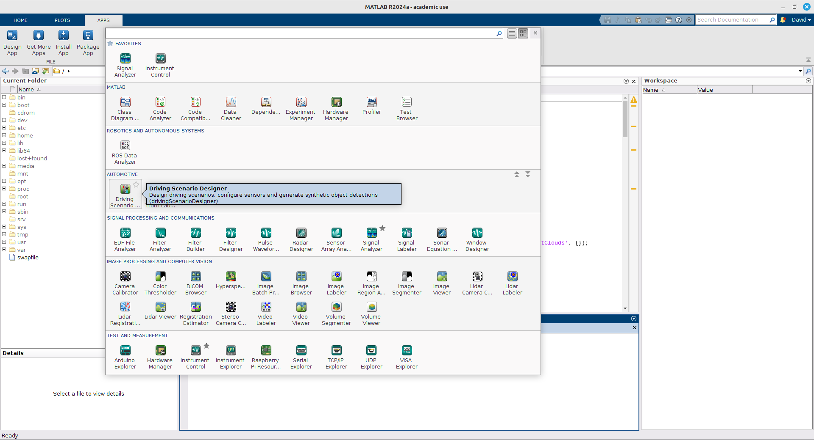
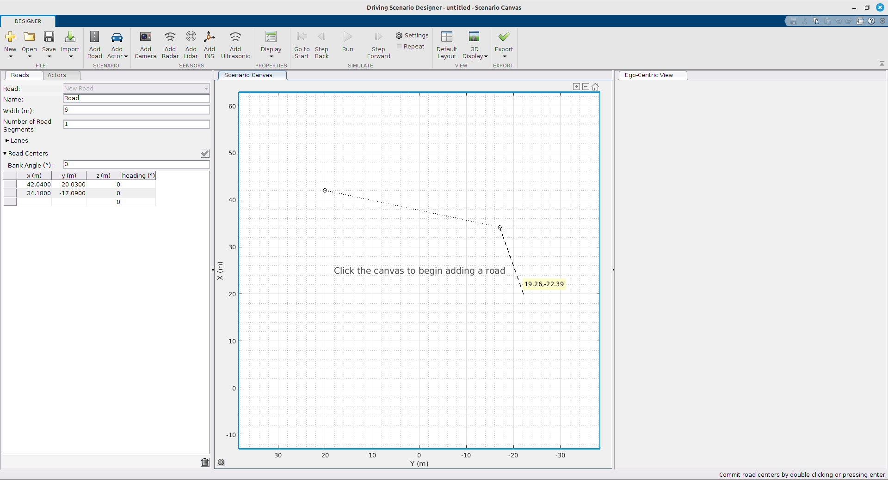

<!--
author:   David Croft
email:    david.croft@warwick.ac.uk
version:  0.1.0
language: en
narrator: US English Male

classroom: false
icon: https://dscroft.github.io/liascript_materials/assets/logo.svg

import: https://dscroft.github.io/liascript_materials/assets/utils.md

@style
.flex-container {
    display: flex;
    flex-wrap: wrap; /* Allows the items to wrap as needed */
    align-items: stretch;
    gap: 20px; /* Adds both horizontal and vertical spacing between items */
}

.flex-child { 
    flex: 1;
    margin-right: 20px; /* Adds space between the columns */
}

@media (max-width: 600px) {
    .flex-child {
        flex: 100%; /* Makes the child divs take up the full width on slim devices */
        margin-right: 0; /* Removes the right margin */
    }
}
@end
-->

# Matlab Tutorial: Sensor and ADAS toolbox

Learning Outcomes
=================

By the end of this sessions you will be able

- To independently use Matlab ADAS toolbox to generate scenario, add actors and run the simulations.
- To add off the shelf sensors to vehicle.
- To use the sensors for detection of other actors.
- To understand the limitation of the simulated sensors.
- To compare different sensors via simulations.

## Introduction - scenarios in Matlab

We are going to build a scenario with matlab to test our autonomous vehicle/ADAS function.
In particular we want to build the scenario (streets, crossroads,  etc.)

- We want to learn to add different actors (ego vehicle, other vehicles, pedestrians) and to move them in the scenario as needed.
- We want to learn how to add sensors  to our vehicle and calibrate their parameters.
- We are going to use Matlab 2024b and the ADAS toolbox.

### Actor properties

<!-- style="display: none" -->
https://uk.mathworks.com/help/driving/ug/create-actor-and-vehicle-trajectories.html

In a driving scenario, actors are represented as cuboid objects with defined length, width, and height. 

Each actor can also have a radar cross section (in dBsm), which can be further specified using azimuth and elevation angles. The position of an actor is set at the center of its bottom face, serving as both the contact point with the ground and the actor’s rotational center.

Vehicles are a specialized type of actor with additional properties: 

- Wheelbase (distance between front and rear axles).
- Front overhang (distance from the front axle to the front of the vehicle)
- Rear overhang (distance from the rear axle to the back of the vehicle). 

Unlike general actors, a vehicle’s position is defined at the center of the rear axle on the ground, which is the point traditional used for ackermann vehicles as it simplifies steering and odometry calculations.

Although it is possible to customize your own actors the defaults will be sufficient for these lab tasks and are as follows:

<!--data-title="Default actor dimensions"
data-type="none"
-->
| Actor Classification | Length | Width | Height | Wheelbase | Front Overhang | Rear Overhang | Radar Cross-Section |
|----------------------|--------|-------|--------|-----------|----------------|---------------|---------------------|
| Pedestrian           | 0.24 m | 0.45 m| 1.7 m  | N/A       | N/A            | N/A           | -8 dBsm             |
| Automobile           | 4.7 m  | 1.8 m | 1.4 m  | 2.8 m     | 0.9 m          | 1.0 m         | 10 dBsm             |
| Motorcycle           | 2.2 m  | 0.6 m | 1.5 m  | 1.51 m    | 0.37 m         | 0.32 m        | 0 dBsm              |

## Task 1 - ADAS Scenario GUI

Important Classes for Scenario:

- The `drivingScenario`  class creates a driving scenario object.
- Actors are objects in the scene  that will affect the scenario which can be stationary or moving.
- Waypoints are defined for each actor to simulate movement
- Speed can be defined per waypoint to control the speed of the actor
- Road are can be defined in the scenario

- From Exercise 4 onwards: Adding sensors to egoVehicle

### Opening the GUI

Using the Apps tab in Matlab, search for or find the “Driving Scenario Designer” app.

### Adding Roads

At the top of the Driving Scenario Designer GUI, you can add roads to the scenario.

- Click on the “Add Road” button to create a new road
- Click directly in the "Scenario Canvas" window to place the road.
  - Details of the road can be edited in the left panel if greater accuracy is needed. 

### Adding Actors

- Use “Add Actor” to select an
actor class and click on the
canvas to place the actor

- Edit first waypoint for starting
parameters, or click and drag
the actor in the canvas to
move the starting position

10

### Adding Waypoints

- Right click the actor to add
waypoint on the canvas

- Alternatively use the buttons
next to trajectory on the left

- You can fine tune and edit

points through the table on
the left or clicking and
dragging the waypoint

11

### Editing Speed through Waypoints

- Edit speed

through each
waypoint through
the table

- Additionally, a
pause at the
waypoint can be
added

12

### Adding Sensors

- Clicking the sensors to
add will allow you to
place the sensor on
the ego vehicle

- The sensor parameters
can be edited through
the left side based on
specification

13

### Viewing Scenario in GUI

14

## Task Radar 

<!-- style="display: none" -->
https://uk.mathworks.com/help/driving/ug/model-radar-sensor-detections.html