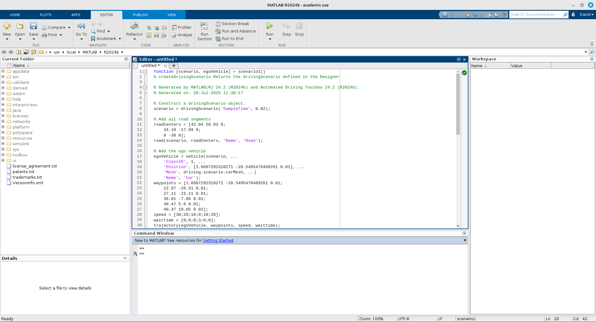

<!--
author:   David Croft
email:    david.croft@warwick.ac.uk
version:  0.1.0
language: en
narrator: US English Male

classroom: false

import: http://localhost:8000/assets/macros.md

-->

# Matlab Tutorial: Sensor and ADAS toolbox

Learning Outcomes
=================

By the end of this sessions you will be able

- To independently use Matlab ADAS toolbox to generate scenario, add actors and run the simulations.
- To add off the shelf sensors to vehicle.
- To use the sensors for detection of other actors.
- To understand the limitation of the simulated sensors.
- To compare different sensors via simulations.

## Introduction - scenarios in Matlab

We are going to build a scenario with matlab to test our autonomous vehicle/ADAS function.
In particular we want to build the scenario (streets, crossroads,  etc.)

- We want to learn to add different actors (ego vehicle, other vehicles, pedestrians) and to move them in the scenario as needed.
- We want to learn how to add sensors  to our vehicle and calibrate their parameters.
- We are going to use Matlab 2024b and the ADAS toolbox.

### Actor properties

<!-- style="display: none" -->
https://uk.mathworks.com/help/driving/ug/create-actor-and-vehicle-trajectories.html

In a driving scenario, actors are represented as cuboid objects with defined length, width, and height. 

Each actor can also have a radar cross section (in dBsm), which can be further specified using azimuth and elevation angles. The position of an actor is set at the center of its bottom face, serving as both the contact point with the ground and the actor’s rotational center.

Vehicles are a specialized type of actor with additional properties: 

- Wheelbase (distance between front and rear axles).
- Front overhang (distance from the front axle to the front of the vehicle)
- Rear overhang (distance from the rear axle to the back of the vehicle). 

Unlike general actors, a vehicle’s position is defined at the center of the rear axle on the ground, which is the point traditional used for ackermann vehicles as it simplifies steering and odometry calculations.

Although it is possible to customize your own actors the defaults will be sufficient for these lab tasks and are as follows:

<!--data-title="Default actor dimensions"
data-type="none"
-->
| Actor Classification | Length | Width | Height | Wheelbase | Front Overhang | Rear Overhang | Radar Cross-Section |
|----------------------|--------|-------|--------|-----------|----------------|---------------|---------------------|
| Pedestrian           | 0.24 m | 0.45 m| 1.7 m  | N/A       | N/A            | N/A           | -8 dBsm             |
| Automobile           | 4.7 m  | 1.8 m | 1.4 m  | 2.8 m     | 0.9 m          | 1.0 m         | 10 dBsm             |
| Motorcycle           | 2.2 m  | 0.6 m | 1.5 m  | 1.51 m    | 0.37 m         | 0.32 m        | 0 dBsm              |

## Task 1 - ADAS Scenario GUI

Important Classes for Scenario:

- The `drivingScenario`  class creates a driving scenario object.
- Actors are objects in the scene  that will affect the scenario which can be stationary or moving.
- Waypoints are defined for each actor to simulate movement
- Speed can be defined per waypoint to control the speed of the actor
- Road are can be defined in the scenario

- From Exercise 4 onwards: Adding sensors to egoVehicle

### Opening the GUI

Using the Apps tab in Matlab, search for or find the “Driving Scenario Designer” app.

### Adding Roads

At the top of the Driving Scenario Designer GUI, you can add roads to the scenario.

- Click on the “Add Road” button to create a new road
- Click directly in the "Scenario Canvas" window to place the road.
  - Details of the road can be edited in the left panel if greater accuracy is needed. 

### Adding Actors

- Use “Add Actor” to select an
actor class and click on the
canvas to place the actor

- Edit first waypoint for starting
parameters, or click and drag
the actor in the canvas to
move the starting position

### Adding Waypoints

Right click the actor to add waypoint on the canvas.

- Alternatively use the buttons next to trajectory on the left.

You can fine tune and edit points through the table on the left.

- Or clicking and dragging the waypoint in the Scenario Canvas.

### Editing Speed through Waypoints

Edit speed through each waypoint through the Trajectory section of each actors properties.

- Matlab will interpolate the speed between waypoints to provide a smooth transition.

- Additionally, a pause at the waypoint can be added if you need the actor to stop at a specific point.

### Running the scenario

To run the scenario to confirm that all actors are moving as expected, click the "Run" button at the top of the GUI.

!?

<b style="color: rgb(var(--color-highlight));">Important note</b> 

Notice the simulation time in the bottom right corner of the Scenario Canvas (middle of the GUI).

- Depending on the complexity of the scenario and the hardware specifications of the computer you are using, the simulation may run significantly slower than real time.
- This can be adjusted in the SIMULATE settings at the top, most notably by increasing the Sample Time.

  - But this comes at the cost of decreased simulation fidelity.

Simulation time shows the time elapsed from the perspective of within the simulation, not the real world clock.
When attempting to debug scenarios, especially delay times and velocities, it is important to keep this in mind.

### Saving/Exporting the scenario

There are two files that we are concerned with when saving a driving scenario.

1. The `.mat` file which contains the scenario data, including the actors, roads, and waypoints.
2. The exported `.m` file which contains Matlab code equivalent of the scenario.
   
The `.m` file is where you will had added any data processing and analysis code.

Saving
------

To save the scenario file, click the "Save" button at the top of the GUI.

Exporting
----------

To export the scenario to a `.m` file, click the "Export" button at the top of the GUI.

- Then select the "MATLAB function" option.

Once exported you should see the Matlab code in the main Matlab window.

## Task 2 - Adding Sensors

### Add second actor

Add a second actor to the scenario such as a truck.

- This can be done by right clicking the scenario canvas and selecting "Add Actor" or using the "Add Actor" button at the top of the GUI.
- A second actor is needed so that we have something for the sensors to detect.

### Adding Sensors

Clicking the sensors options at the top of the GUI will allow you to add sensors to the ego vehicle.

- By default the ego vehicle will be the first vehicle that you added to your scenario.

  - This can be changed in the actor properties on the left side of the GUI.

The sensor canvas will allow you to place sensors anywhere on the ego vehicle.

- For these tasks it is recommended that you use the standard pre-defined locations.

The sensor parameters can be edited through using the Sensors tab on the left side of the GUI.

**Add a single Radar sensor to the front bumper of the ego vehicle.**

### Running the scenario

Run the scenario as before to see and confirm that the radar sensor is detecting the second actor.

!?

## Task Radar 

<!-- style="display: none" -->
https://uk.mathworks.com/help/driving/ug/model-radar-sensor-detections.html